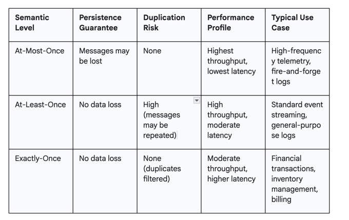

# Exactly-Once Semantics

Kafka's Exactly-Once Semantics (Transaction) using Java.

[//]: # (The semantic of exactly-once presented by kafka through transaction_id and epoch, in each producer, it maintain by PID and sequence number)
# The Architecture of Certainty: Achieving Exactly-Once Processing in Apache Kafka's Distributed Ecosystemmo

The taxonomy of delivery semantics is traditionally divided into three distinct levels:
at-most-once, at-least-once, and exactly-once.
At-most-once delivery is defined by a paradigm where messages are transmitted without any guarantee
of receipt. If a failure occurs during transmission or processing, the message is lost and never
redelivered. This is often implemented as a "fire and forget" mechanism where the producer does not
wait for an acknowledgment from the broker, or the consumer commits its progress before completing
the actual processing of a record.1 While this model provides the highest possible throughput and
the lowest latency, it is unsuitable for applications where data integrity is a requirement.4

At-least-once delivery represents the most common baseline for reliable systems. In this model, the
system ensures that no data is lost by retrying the transmission of messages until a successful
acknowledgment is received.2 The consequence of this reliability is the potential for duplication.
If a producer successfully writes a message but the acknowledgment is lost due to a network
interruption, the producer will resend the message, resulting in multiple copies of the same record
within the broker’s log.2 Similarly, a consumer may process a message but crash before it can
persist its new offset, leading the next consumer instance to re-process the same data.1

Exactly-once semantics (EOS) represent the most rigorous guarantee, ensuring that each message is
delivered and processed exactly one time.1 This model eliminates both the risk of data loss and the
operational burden of handling duplicates.2 Achieving this level of certainty requires a complex
orchestration of idempotency and atomic transactions across the entire message lifecycle.2 The
following table summarizes the comparative attributes of these three semantic levels.



# Theoretical Constraints: The Impossibility of Deterministic Delivery

The concept of "exactly-once delivery" is frequently criticized by distributed systems theorists as a mathematical impossibility, particularly when operating over an asynchronous and unreliable network.7 This skepticism is grounded in the Two Generals' Problem, a thought experiment that demonstrates the inability of two parties to reach a perfect consensus on an action when their only means of communication is a lossy channel.12
In the scenario, two generals, positioned on opposite sides of an enemy city, must attack simultaneously to succeed. They can only coordinate by sending messengers who risk being captured.12 If General A sends a message proposing an attack time, they cannot attack until they know General B received the message. General B must send an acknowledgment, but then General B cannot be sure General A received the acknowledgment. This creates an infinite regress where every acknowledgment requires its own acknowledgment, and neither party can ever achieve absolute certainty regarding the other's state.13
Translated to the realm of messaging systems, the producer (General A) and the broker (General B) face the same dilemma.14 If a producer does not receive an acknowledgment after sending a message, it cannot distinguish between three specific failure modes:
The message was lost before it reached the broker.
The message was successfully written to the broker’s log, but the acknowledgment was lost in transit back to the producer.
The broker is still processing the request or has crashed after writing the data but before sending the response.14
Because the producer can never be 100% certain if the broker has persisted the message, it must either give up (risking data loss) or retry (risking duplication). No deterministic protocol can solve this problem in an asynchronous system where messages can be delayed or lost indefinitely.11 Therefore, true "exactly-once delivery" at the network layer remains a theoretical impossibility.11

# Kafka’s Paradigm Shift: Exactly-Once Processing vs. Delivery

The breakthrough in Apache Kafka’s implementation of exactly-once semantics lies in its recognition that while "exactly-once delivery" is impossible, "exactly-once processing" (EOP) is achievable through the use of idempotency and atomic transactions.2 Kafka does not attempt to solve the Two Generals' Problem at the network layer; instead, it ensures that even if a message is delivered multiple times, its effect on the system’s state occurs only once.15
Kafka's EOS is essentially "effectively-once" processing.7 This is achieved by separating the physical transmission of data from the logical commitment of that data to the log.7 To the end consumer, the result is indistinguishable from exactly-once delivery because duplicate messages are discarded at the broker level and aborted transactions are filtered out at the client level.15 The implementation relies on three fundamental pillars:
Idempotent Producers: These ensure that retries resulting from network uncertainty do not result in duplicate entries in the log.2
The Transactional API: This allows a producer to bundle multiple writes (across various partitions and topics) into a single atomic unit.2
Consumer Isolation: This ensures that consumers only see data that has been fully "decided" (committed), preventing them from acting on partial or failed transactions.7
Through these mechanisms, Kafka provides a "consume-transform-produce" loop where the consumption of an input offset and the production of an output message happen atomically.4 If the process fails, the entire transaction is rolled back, the consumer's offset is not advanced, and the system resumes from a consistent state.1

# The Technical Mechanism of Idempotent Producers
The foundation of exactly-once semantics in Kafka is the idempotent producer, introduced in version 0.11 to solve the problem of duplicate log entries caused by producer retries.20 Before this feature, a producer that failed to receive an acknowledgment would resend the message, and the broker, seeing it as a new request, would append it to the log again.7
To prevent this, Kafka assigns each producer a unique Producer ID (PID) and a monotonically increasing sequence number for every message sent to a specific partition.5 When a producer initializes, it requests a PID from the broker. Every message batch sent thereafter contains the PID and the sequence number of the first record in the batch.2
The broker maintains an in-memory map of the last processed sequence number for every PID-partition combination.15 When a new batch arrives, the broker validates the sequence number against its records:
If the sequence number is exactly one greater than the last recorded number, the broker appends the batch and increments the expected number.5
If the sequence number is less than or equal to the last recorded number, the broker recognizes it as a duplicate, ignores the write, but still sends a successful acknowledgment to the producer to prevent unnecessary retries.15
If the sequence number is more than one greater than the expected number, the broker detects a gap (indicating lost messages) and rejects the write with an OutOfOrderSequenceException.5
This protocol ensures that even if a producer sends the same message ten times due to network instability, only one copy will ever be appended to the broker's log.20 It is important to note that idempotence is limited to a single producer session; if a producer process restarts without a transactional.id, it receives a new PID, and the idempotency guarantee is lost for messages sent by the previous instance.

# Fencing and Zombie Instances: Ensuring Single-Writer Consistency
A critical challenge in distributed transactions is the "zombie" producer—a process that has been partitioned from the network or is undergoing a long GC pause, leading the cluster to believe it has failed.7 If a new instance of the producer starts up and begins a new transaction while the old instance is still attempting to send data from its "dead" session, the integrity of the data stream could be compromised.2
Kafka handles this through a fencing mechanism tied to the transactional.id and the producer epoch.8 When a producer calls initTransactions(), the coordinator increments the epoch associated with that transactional.id in the __transaction_state log.5 Any subsequent request from a producer with an older epoch is immediately rejected.5 This "fencing" operation ensures that only the most recently initialized instance of a producer can successfully commit data.8
This fencing extends to the consumer offsets as well. In a "read-process-write" cycle, the producer includes the consumer offsets in its transaction.19 If a zombie producer attempts to commit offsets from a stale session, the Transaction Coordinator will reject the commit, preventing the zombie from advancing the consumer's progress and ensuring that the new producer instance can take over from the correct state.

## Structure
 
# System Flow & Implementation (How I use it)

I implemented the **Consume-Transform-Produce** pattern to demonstrate a failure-proof data pipeline.

## 1. The Workflow
The system consists of three main stages operating in a continuous loop:

1.  **Consume**: The `EOSStreamProcessor` reads a batch of raw numbers from the `input-topic`.
2.  **Transform**: It processes the data (Business Logic: multiply by 2).
3.  **Produce (Atomic Commit)**: It writes the result to `output-topic` AND commits the consumer offsets to `__consumer_offsets` in a **single atomic transaction**.

## 2. Technical Implementation Details

### A. Initialization
- **Transactional ID**: I assign a unique `transactional.id` (e.g., `eos-transactional-id`) to the producer. This is crucial for the **Fencing** mechanism to work if the process restarts.
- **Isolation Level**: The `OutputVerifier` (Consumer) is configured with `isolation.level=read_committed`. This ensures it *only* sees data from fully successful transactions.

### B. The Transaction Loop (Code Logic)
Inside `EOSStreamProcessor.java`:

```java
producer.beginTransaction(); // Start the atomic unit

try {
    // 1. Process records
    for (Record record : records) {
        // Transform logic...
        producer.send(newResult); // Buffer the write (not visible yet)
    }

    // 2. Add Consumer Offsets to the Transaction
    // This is the magic step! We commit "what we read" together with "what we wrote".
    producer.sendOffsetsToTransaction(currentOffsets, consumerGroupId);

    // 3. Commit
    producer.commitTransaction(); // Atomic "All or Nothing"
} catch (Exception e) {
    producer.abortTransaction(); // Rollback everything
}
```

### C. Chaos Engineering (Crash Simulation)
To prove the system works, I injected a **Random Crash** (`Runtime.halt()`) right before the commit step.
*   **Without Transactions**: This would lead to "Duplicate Data" (because we processed it, but crashed before committing offsets, so we'd re-process it after restart).
*   **With Transactions**: The uncommitted data in Kafka is discarded. When the app restarts, it re-reads the old offset and tries again. **Result: Exactly 1 output.**

## Structure

- `InputProducer`: Generates numbers 1-10.
- `EOSStreamProcessor`: Consumes numbers, multiplies by 2, and produces to output. **Simulates
  random crashes** to prove resilience.
- `OutputVerifier`: Consumes output and checks for duplicates.

## How to Run

### 1. Start Infrastructure

```bash
docker-compose up -d
```

### 2. Build Project

```bash
mvn clean package
```

### 3. Run Components (In separate terminals)

**Terminal 1: The Verifier (Watcher)**

```bash
mvn exec:java -Dexec.mainClass="com.demo.eos.OutputVerifier"
```

**Terminal 2: The Processor (Worker)**
*This will crash randomly. Auto-restart script is not included, please re-run manually when it
crashes.*

```bash
mvn exec:java -Dexec.mainClass="com.demo.eos.EOSStreamProcessor"
```

**Terminal 3: The Input (Trigger)**

```bash
mvn exec:java -Dexec.mainClass="com.demo.eos.InputProducer"
```

## Expected Result

- Even if `EOSStreamProcessor` crashes and you restart it multiple times.
- `OutputVerifier` will **NEVER** show "❌ DUPLICATE DETECTED".
- It will only show "✅ Received Valid" for exactly one result per input.

Huge thanks to:

- You, for reading this README 😄
- Seglo for the amazing idea.